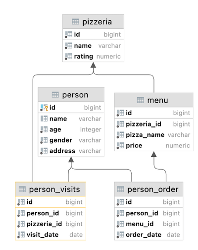

# SQL Bootcamp
Project date: 06.2023  
My first steps to SQL in School 21.

## General Rules

- Using the latest version of PostgreSQL.
- IDE - DataGrip by jetbrains
- All assignments use the following database:
    

## Day's introductions

* Day00 - how relational model works and how to get needed data based on basic constructions of SQL
* Day01 - how to get needed data based on sets constructions and simple JOINs
* Day02 - how to get needed data based on different structures JOINs
* Day03 - how to change data based on DML language
* Day04 - how to use a virtual view and physical snapshot of data
* Day05 - how and when to create database indexes
* Day06 - how to add a new business feature into our data model
* Day07 - how to use specific OLAP constructions to get a “Value” from data
* Day08 - how database works with transactions and isolation levels
* Day09 - how to create and use functional blocks in Databases
* Team00 - Today you will implementing a quick solution on SQL to achieve results of Traveling Salesman Problem
* Team01 - Today you will know what DWH is and how to create a first ETL process
